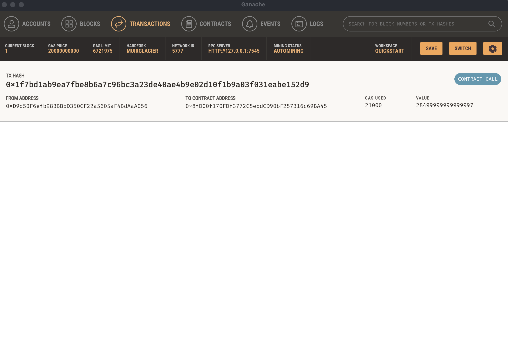
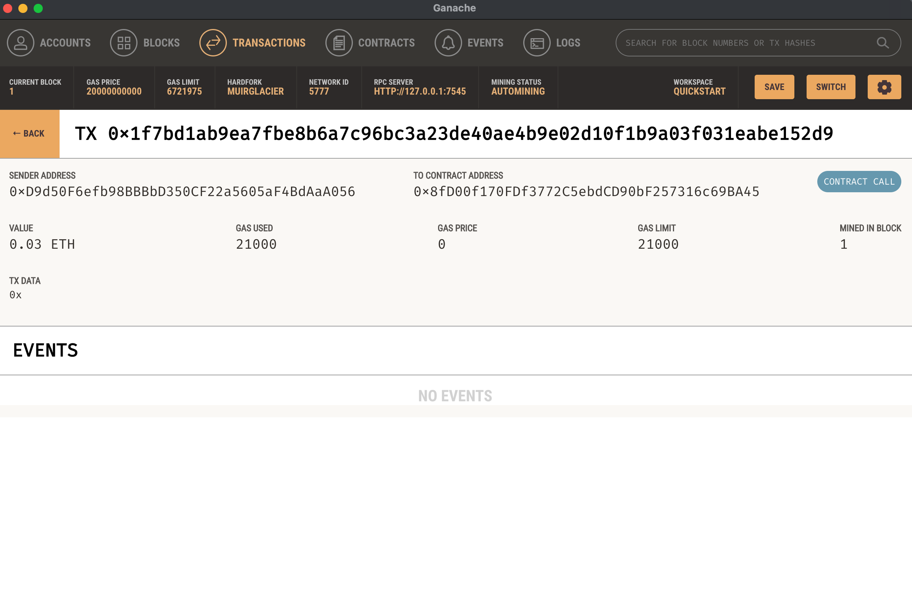

# Module_19_Challenge
In this repository we will be integrating the Ethereum blockchain network into an application in order to enable your customers to instantly pay the fintech professionals whom they hire with cryptocurrency.


---

## Technologies

To run this application, you need the following tools installed in the same directory that you are working in.


[Web3.py](https://web3py.readthedocs.io/en/stable/overview.html): A Python library for connecting to and performing operations on Ethereum-based blockchains.

[ethereum-tester](https://pypi.org/project/ethereum-tester/0.1.0a4/): A Python library that provides access to the tools we’ll use to test Ethereum-based applications.

[mnemonic](https://pypi.org/project/mnemonic/): A Python implementation for generating a 12- or 24-word mnemonic seed phrase based on the BIP-39 standard.

[bip44](https://pypi.org/project/bip44/): A Python implementation for deriving hierarchical deterministic wallets from a seed phrase based on the BIP-44 standard.

[Ganache](https://www.trufflesuite.com/ganache) This program allows you to quickly and easily set up/test a local blockchain. 


Streamlit - Python library for building web interfaces for your Python applications.


## Installation Guide

Make sure all of the above tools are installed in your dev environment.

```
pip install streamlit
pip install web3==5.17
pip install eth-tester==0.5.0b3
pip install mnemonic
pip install bip44

```
---

## Usage

To use this, navigate to the terminal where this repository is located, and run the following: 
```
streamlit run fintech_finder.py
```
* Once you select the candidate and the amount of ether to send, click the button labeled "Send Trasaction" as it shows in the below image. 
  
----


* Once you send the trasaction, it can be verified in the Ganache application. (See the two images below.)





----

## Contributors

<b>_G. Cale McDowell_

[@gcm107](https://github.com/gcm107)


